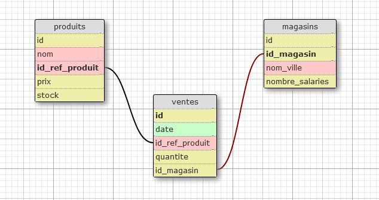

# Simplon-ventes-PME
[Objectifs visés:](brief/Brief%20projet%20Analyser%20les%20ventes%20d’une%20PME%20-%20Data%20Engineer%20-%20V2.pdf)
- Créer et mettre en œuvre un environnement à deux services : un pour l’exécution des scripts (import de données) et un autre pour la base de données
- Analyser un jeu de données et en expliquer ses caractéristiques
- Créer une base de données adaptée pour le stockage du jeu de données
- Importer les données
- Réaliser un premier niveau d’analyses de données avec SQL
- Stocker les résultats des analyses.


# Librables:

## ● Le schéma de l’architecture conçu

## ● Le schéma des données (sous une forme standard, MCD par exemple)
<div style="text-align:center">
  
</div>

## ● Le Dockerfile

## ● Le fichier yaml du Docker Compose

## ● Le(s) script(s) d'exécution pour la collecte, transformation, et import des données
- Script final: [api/fast.py](api/fast.py)
- Document de travail: [notebooks/simplon-ventes-PME.ipynb](notebooks/simplon-ventes-PME.ipynb)

## ● Le fichier sql
[datasets/table.sqlite](datasets/table.sqlite)

## ● Une note rappelant les résultats d’analyse obtenus (point 4.a, 4.b, 4.c).
- 4.a requête pour obtenir le chiffre d'affaires total
```sql
SELECT SUM(ventes.quantite*produits.prix) AS ventes_total 
FROM ventes
LEFT JOIN produits ON ventes.id_ref_produit = produits.id_ref_produit
```
|   | ventes_total |
| - | ------------- |
| 1 | 5268.78 |


- 4.b requête pour obtenir les ventes par produit
```sql
SELECT produits.nom,
       SUM(ventes.quantite) AS nombre_ventes,
       produits.prix AS prix_unitaire
FROM produits
LEFT JOIN ventes ON (ventes.id_ref_produit = produits.id_ref_produit)
GROUP BY produits.nom
```
|   | nom | nombre_ventes | prix_unitaire |
| - | ------------- | ------------- | ------------- |
| 1 | Produit A  | 24  | 49.99  |
| 2 | Produit B  | 27  | 19.99  |
| 3 | Produit C  | 15  | 29.99  |
| 4 | Produit D  | 21  | 79.99  |
| 5 | Produit E  | 35  | 39.99  |

- 4.c requête pour obtenir les ventes par région
